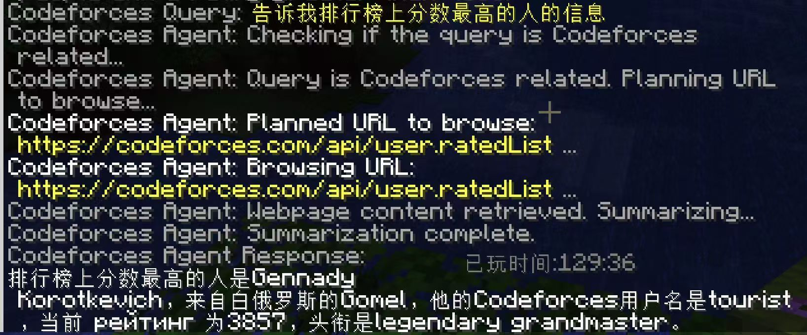
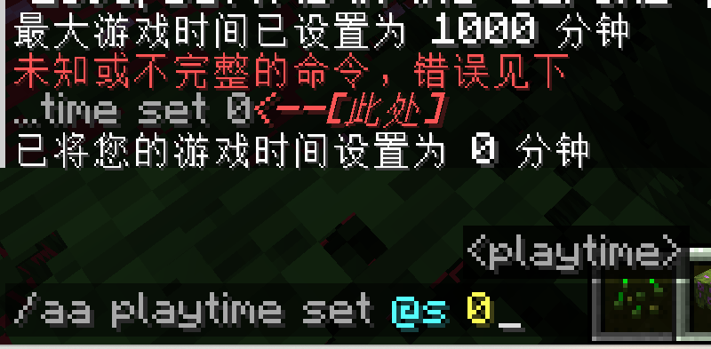
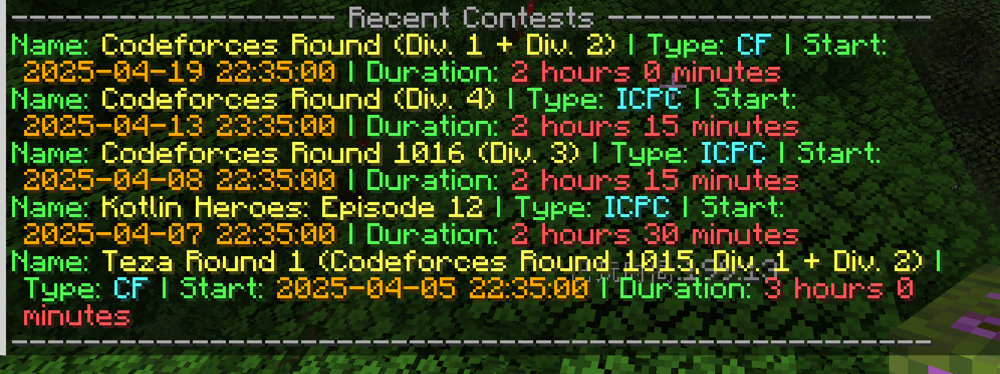
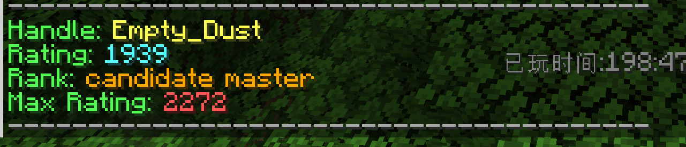

# Anti-Addiction Mod for Minecraft

<p align="center">
  <!--  -->
  <br>
  <em>A comprehensive solution for playtime management and Codeforces integration</em>
</p>

[](https://www.minecraft.net/)
[](https://files.minecraftforge.net/)
[](LICENSE)

## 📖 Overview

Anti-Addiction is a comprehensive Minecraft mod designed for server administrators who want to monitor and control players' game time. It also includes features for Codeforces integration and AI-powered chat assistants.

## ✨ Features

### 🕒 Playtime Management
- Track players' playtime across sessions
- Set configurable time limits for daily gameplay
- Automatic warnings and kicks when limits are reached
- Daily automatic playtime reset at configurable times

### 🏆 Codeforces Integration
- Query Codeforces user profiles directly in-game
- Get upcoming contest information
- Bond Minecraft accounts to Codeforces IDs
- AI-powered Codeforces query assistant

### 💬 AI Chat Integration
- Chat with AI assistants directly in Minecraft
- Supports dialogue context for conversations
- Configurable API endpoints and proxy settings
- Multiple models support

## 🔧 Installation

1. Ensure you have Minecraft Forge for version 1.20.1 installed
2. Download the latest `.jar` file from the [Releases](https://github.com/EmptyDust/anti-addiction-2/releases) page
3. Place the downloaded jar file into your Minecraft server's `mods` folder
4. Start your server and the mod will generate default configuration files

## ⚙️ Configuration

The mod uses a configuration file located at `config/mod_config.json`. You can edit this file to customize various settings:

```json
{
  "serverConfig": {
    "enableAntiAddiction": false,
    "aiChatServerAddress": "https://generativelanguage.googleapis.com/v1beta/models/gemini-2.0-flash:generateContent",
    "apiKey": "your-api-key-here",
    "maxPlayTimeMinutes": 240,
    "playtimeFilePath": "config/playtime.json",
    "resetTime": "05:00:00",
    "backupIntervalMinutes": 5,
    "useProxy": false,
    "proxyHost": "",
    "proxyPort": 8080
  },
  "playerConfigs": []
}
```

### Configuration Options

| Option                  | Description                                           | Default                  |
| ----------------------- | ----------------------------------------------------- | ------------------------ |
| `enableAntiAddiction`   | Enable/disable the playtime limiting feature          | `false`                  |
| `aiChatServerAddress`   | URL for the AI chat API endpoint                      | Gemini API endpoint      |
| `apiKey`                | API key for authentication with the AI service        | `""`                     |
| `maxPlayTimeMinutes`    | Maximum allowed playtime in minutes before kicking    | `240` (4 hours)          |
| `playtimeFilePath`      | Path to store player playtime data                    | `"config/playtime.json"` |
| `resetTime`             | Time of day when playtime counters reset (24h format) | `"05:00:00"`             |
| `backupIntervalMinutes` | How often playtime data is backed up                  | `5`                      |
| `useProxy`              | Enable/disable proxy for API requests                 | `false`                  |
| `proxyHost`             | Proxy server hostname or IP address                   | `""`                     |
| `proxyPort`             | Proxy server port number                              | `8080`                   |

## 🎮 Commands

<details open>
<summary><b>Playtime Management</b></summary>

| Command                               | Description                      | Permission |
| ------------------------------------- | -------------------------------- | ---------- |
| `/aa playtime set <player> <minutes>` | Set a player's playtime          | Admin (3)  |
| `/aa playtime set_max_time <minutes>` | Set the maximum allowed playtime | OP (4)     |
| `/aa playtime clear <player>`         | Clear a player's playtime        | Admin (3)  |
| `/aa playtime clearall`               | Clear all players' playtimes     | OP (4)     |

</details>

<details open>
<summary><b>Codeforces Integration</b></summary>

| Command               | Description                                         |
| --------------------- | --------------------------------------------------- |
| `/cf info <username>` | Get detailed info about a Codeforces user profile   |
| `/cf contest`         | List upcoming and recent Codeforces contests        |
| `/cf bond <id>`       | Link your Minecraft account to a Codeforces ID      |
| `/cf query <content>` | Ask the AI agent about Codeforces-related questions |

</details>

<details open>
<summary><b>AI Chat</b></summary>

| Command                       | Description                              | Permission |
| ----------------------------- | ---------------------------------------- | ---------- |
| `/chat gemini <content>`      | Send a one-time message to Gemini AI     | Player     |
| `/chat gemini <content> true` | Start/continue a dialogue with Gemini AI | Player     |
| `/chat clear`                 | Clear your dialogue history              | Player     |

</details>

<details open>
<summary><b>Configuration (Admin Only)</b></summary>

| Command                            | Description                 | Permission |
| ---------------------------------- | --------------------------- | ---------- |
| `/chat config set_url <url>`       | Set the AI chat server URL  | OP (4)     |
| `/chat config set_key <apiKey>`    | Set the API key for AI chat | OP (4)     |
| `/chat proxy enable <true\|false>` | Enable or disable proxy     | Admin (3)  |
| `/chat proxy host <hostname>`      | Set proxy host              | Admin (3)  |
| `/chat proxy port <port>`          | Set proxy port              | Admin (3)  |
| `/chat proxy status`               | View current proxy settings | Admin (3)  |

</details>

## 📷 Screenshots & Examples

<div align="center">
  
  <p><em>🤖 AI-powered Codeforces query assistant helps answer complex competitive programming questions</em></p>
</div>

<details>
<summary><b>📸 View More Screenshots</b></summary>
<div align="center">
  <table>
    <tr>
      <td align="center" width="50%">
        
        <p><em>⏱️ Playtime tracking and management interface</em></p>
      </td>
      <td align="center" width="50%">
        
        <p><em>💬 In-game AI chat assistant</em></p>
      </td>
    </tr>
    <tr>
      <td align="center" width="50%">
        
        <p><em>🏆 Codeforces contest information display</em></p>
      </td>
      <td align="center" width="50%">
        
        <p><em>👤 Codeforces user profile lookup</em></p>
      </td>
    </tr>
  </table>
</div>
</details>

> **Note**: ✨ This mod provides visual feedback directly in Minecraft chat. Screenshots may vary based on your Minecraft resource pack and client settings.

<!-- 
Screenshot descriptions:
1. cf_query_1.jpg - Shows the AI assistant answering Codeforces-related questions
2. playtime.png - Playtime management interface
3. chat.png - AI chat assistant interface
4. cf_contest.png - Codeforces contest information display
5. cf_info.png - Codeforces user profile lookup

To use this template:
1. Create a 'docs/images' folder to store screenshots
2. Add corresponding screenshot files, or modify image paths
-->

## ⚠️ Prerequisites

- Minecraft 1.20.1
- Forge 47.3.0+
- Java 17

## 🤝 Contributing

Contributions are welcome! Please feel free to submit a Pull Request.

## 📜 License

**All Rights Reserved**

This software is provided under the "All Rights Reserved" license, which means:

1. You are permitted to:
   - Download and use the mod on your private server
   - Make modifications for personal use only

2. You are NOT permitted to:
   - Redistribute this software in any form
   - Modify and redistribute this software
   - Use any part of the code in other projects without explicit permission
   - Claim this software as your own

For any permissions not explicitly stated here, please contact the author directly.

## 📧 Contact

- Author: EmptyDust
- Website: www.emptydust.com

---

<p align="center">
  Made with ❤️ by EmptyDust
</p>
