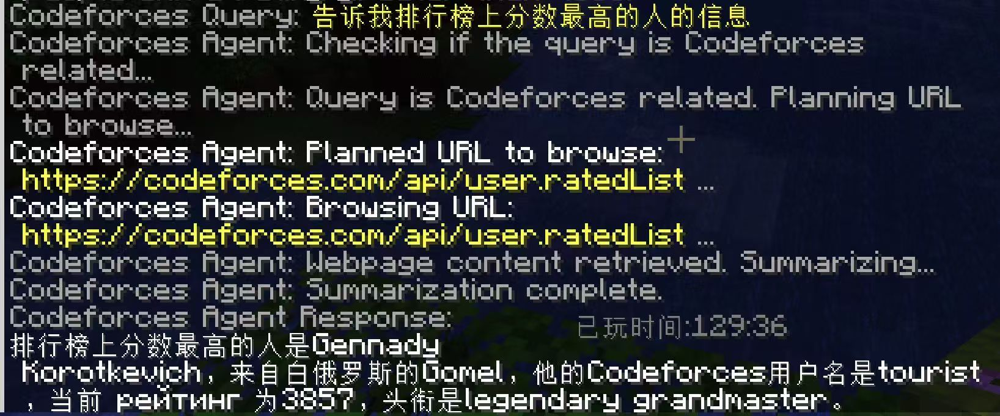

# Anti-Addiction Mod for Minecraft

<!-- <p align="center">
  
  <br>
  <em>A Minecraft Forge mod to manage playtime and more!</em>
</p> -->

[](https://www.minecraft.net/)
[](https://files.minecraftforge.net/)
[](LICENSE)

## 📖 Overview

Anti-Addiction is a comprehensive Minecraft mod designed for server administrators who want to monitor and control players' game time. It also includes features for Codeforces integration and AI-powered chat assistants.

## ✨ Features

### 🕒 Playtime Management
- Track players' playtime across sessions
- Set configurable time limits for daily gameplay
- Automatic warnings and kicks when limits are reached
- Daily automatic playtime reset at configurable times

### 🏆 Codeforces Integration
- Query Codeforces user profiles directly in-game
- Get upcoming contest information
- Bond Minecraft accounts to Codeforces IDs
- AI-powered Codeforces query assistant

### 💬 AI Chat Integration
- Chat with AI assistants directly in Minecraft
- Supports dialogue context for conversations
- Configurable API endpoints
- Multiple models support

## 🔧 Installation

1. Ensure you have Minecraft Forge for version 1.20.1 installed
2. Download the latest `.jar` file from the [Releases](https://github.com/EmptyDust/anti-addiction-2/releases) page
3. Place the downloaded jar file into your Minecraft server's `mods` folder
4. Start your server and the mod will generate default configuration files

## ⚙️ Configuration

The mod uses a configuration file located at `config/mod_config.json`. You can edit this file to customize various settings:

```json
{
  "serverConfig": {
    "enableAntiAddiction": true,
    "aiChatServerAddress": "your-api-endpoint-url",
    "maxPlayTimeMinutes": 240,
    "playtimeFilePath": "config/playtime.json",
    "resetTime": "05:00:00",
    "backupIntervalMinutes": 5
  },
  "playerConfigs": []
}
```
### Configuration Options

| Option                  | Description                                           | Default                  |
| ----------------------- | ----------------------------------------------------- | ------------------------ |
| `enableAntiAddiction`   | Enable/disable the playtime limiting feature          | `false`                  |
| `aiChatServerAddress`   | URL for the AI chat API endpoint                      | `"why.are.you.here"`     |
| `maxPlayTimeMinutes`    | Maximum allowed playtime in minutes before kicking    | `240` (4 hours)          |
| `playtimeFilePath`      | Path to store player playtime data                    | `"config/playtime.json"` |
| `resetTime`             | Time of day when playtime counters reset (24h format) | `"05:00:00"`             |
| `backupIntervalMinutes` | How often playtime data is backed up                  | `5`                      |

## 🎮 Commands

### Playtime Commands
- `/aa playtime set <player> <minutes>` - Set a player's playtime
- `/aa playtime set_max_time <minutes>` - Set the maximum allowed playtime
- `/aa playtime clear <player>` - Clear a player's playtime
- `/aa playtime clearall` - Clear all players' playtimes

### Codeforces Commands
- `/cf info <username>` - Get info about a Codeforces user
- `/cf contest` - List upcoming Codeforces contests
- `/cf bond <id>` - Link your Minecraft account to a Codeforces ID
- `/cf query <content>` - Ask the AI about Codeforces-related questions

### Chat Commands
- `/chat gemini <content>` - Send a message to the Gemini AI
- `/chat gemini <content> true` - Start a dialogue with Gemini AI
- `/chat clear` - Clear your dialogue history
- `/chat config set <url>` - Set the AI chat server URL (Admin only)

## 📷 Screenshots

<p align="center">
  
  <br>
  <em>Query who has the highest rating in codeforces.</em>
</p>

## ⚠️ Prerequisites

- Minecraft 1.20.1
- Forge 47.3.0+
- Java 17

## 🤝 Contributing

Contributions are welcome! Please feel free to submit a Pull Request.

## 📜 License

**All Rights Reserved**

This software is provided under the "All Rights Reserved" license, which means:

1. You are permitted to:
   - Download and use the mod on your private server
   - Make modifications for personal use only

2. You are NOT permitted to:
   - Redistribute this software in any form
   - Modify and redistribute this software
   - Use any part of the code in other projects without explicit permission
   - Claim this software as your own

For any permissions not explicitly stated here, please contact the author directly.

## 📧 Contact

- Author: EmptyDust
- Website: www.emptydust.com

---

<p align="center">
  Made with ❤️ by EmptyDust
</p>
